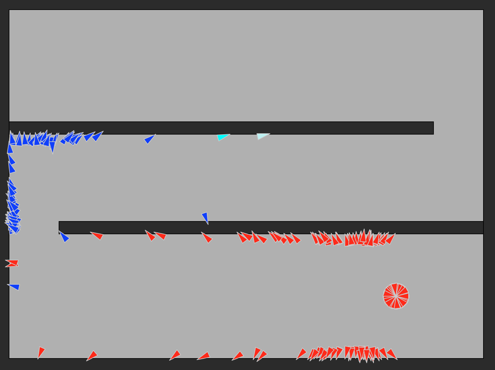

# PathFinders

En este proyecto unas sencillas criaturas aprenden a atravesar un laberinto en 2D mediante un algoritmo evolutivo.  

Cada criatura consiste en un triángulo, el que puede acelerar, frenar y doblar.   
Cada criatura muere cuando choca con un muro o si se queda mucho tiempo sin moverse.  

Las criaturas tienen un cerebro muy sencillo, definido en el archivo mind.py, con 4 neuronas sensores y 2 neuronas motoras.  
Son tan sencillas que no tienen vista, sólo una noción vaga de su ubicación; el cerebro va armando un mapa de qué evadir a medida que evoluciona.  

Las criaturas se colorean para dar información:  

Rojo:         Criaturas nuevas, con cerebros creados aleatoriamente.  
Azul:         Criaturas con el mejor desempeño en la iteración anterior, pequeñamente mutadas.  
Cian claro:   La criatura con el mejor desempeño en la iteración anterior, pequeñamente mutada.  
Cian oscuro:  Criaturas que lograron llegar al final del laberinto la iteración anterior.  

